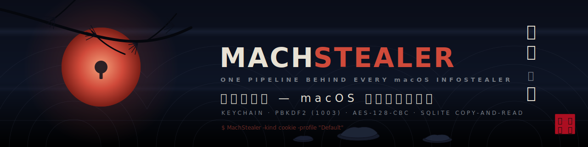

<p align="center">
  
</p>

# MachStealer:One Pipeline Behind Every macOS Infostealer

## Talks & Recognition

[](https://blackhat.com/us-26/arsenal/schedule/index.html?track[]=malware#machstealerone-pipeline-behind-every-macos-infostealer-52134)

Selected for **Black Hat USA 2026 Arsenal** — *MachStealer: One Pipeline Behind Every macOS Infostealer*.
Mandalay Bay, Las Vegas · August 1–6, 2026 · Track: Malware Defense ([session page](https://blackhat.com/us-26/arsenal/schedule/index.html?track[]=malware#machstealerone-pipeline-behind-every-macos-infostealer-52134)).

<table>
  <tr>
    <td align="center">
      <a href="https://youtu.be/mzyQ9-8qsFg">
        
      </a>
      <br><b>▶ Watch the talk (English)</b>
    </td>
    <td align="center">
      <a href="https://youtu.be/9KyRqy37Iao">
        
      </a>
      <br><b>▶ 講演を見る (日本語)</b>
    </td>
  </tr>
</table>

## NOTICE
- This software decrypts and extracts your Google Chrome's cookies, saved passwords, credit cards, browsing history, and installed extensions, then outputs them to standard output.
  - This software **does not** upload any credentials to the internet.
  - This tool works locally only and is for security research purposes.

### Referenced source code
- This repository contains the necessary parts only for PoC (Proof of Concept).

## Disclaimer
- This tool is limited to education and security research purposes only!!
- Unauthorized access to computer systems is illegal.

## Build & Test

### Prerequisites
Install `xgo` for cross-compilation with cgo support:
```bash
go install github.com/crazy-max/xgo@latest
```

### Build
```bash
make build
```

### Test
```bash
make test
```

## Supported OS and Architecture
- **macOS ARM64 only** (Apple Silicon: M1, M2, M3 or later)
- This tool will **refuse to run** on Intel Macs (amd64)

## Features
This tool can decrypt and extract the following data from Google Chrome:
- **Cookies** (`-kind cookie`) — encrypted, decrypted at runtime
- **Saved passwords** (`-kind logindata`) — encrypted, decrypted at runtime
- **Credit cards** (`-kind creditcard`) — encrypted, decrypted at runtime
- **Browsing history** (`-kind history`) — unencrypted, sorted by visit count
- **Installed extensions** (`-kind extension`) — unencrypted, parsed from Preferences JSON

Multiple Chrome profiles (Default, Profile 1, Profile 2, …) are supported via the `-profile` flag.

## Usage

### Discover Chrome profiles

```bash
$ ./MachStealer-darwin-arm64 -list-profiles
```

### Method 1: Automatic (with Keychain access prompt)

When you run the tool without providing the session storage value, it will automatically access the macOS Keychain to retrieve Chrome's master key. This will trigger a system prompt asking for permission.

```bash
# Decrypt cookies (default profile)
$ ./MachStealer-darwin-arm64 -kind cookie

# Decrypt saved passwords (default profile)
$ ./MachStealer-darwin-arm64 -kind logindata

# Decrypt saved credit cards
$ ./MachStealer-darwin-arm64 -kind creditcard

# Dump browsing history (sorted by visit count)
$ ./MachStealer-darwin-arm64 -kind history

# List installed extensions
$ ./MachStealer-darwin-arm64 -kind extension

# Target a non-default Chrome profile
$ ./MachStealer-darwin-arm64 -kind cookie -profile "Profile 1"

# Or specify a database path directly
$ ./MachStealer-darwin-arm64 -kind cookie -targetpath ~/Library/Application\ Support/Google/Chrome/Profile\ 1/Cookies
```

### Method 2: Manual (without Keychain prompt)

To avoid the Keychain access prompt, you can manually extract the Chrome session storage value and provide it via the `-sessionstorage` flag.

**Step 1**: Get the Chrome session storage value from Keychain
```bash
security find-generic-password -wa "Chrome"
```
Or use a forensic tool like [chainbreaker](https://github.com/n0fate/chainbreaker).

**Step 2**: Decrypt data using the session storage value
```bash
# Decrypt cookies
$ ./MachStealer-darwin-arm64 -kind cookie -sessionstorage <session_storage_value>

# Decrypt saved passwords
$ ./MachStealer-darwin-arm64 -kind logindata -sessionstorage <session_storage_value>

# Decrypt saved credit cards
$ ./MachStealer-darwin-arm64 -kind creditcard -sessionstorage <session_storage_value>

# Combine with a specific profile
$ ./MachStealer-darwin-arm64 -kind cookie -profile "Profile 1" -sessionstorage <session_storage_value>
```

## Command-line Options

- `-kind <type>` **(required, unless `-list-profiles`)**: Type of data to decrypt or extract
  - `cookie`: Chrome cookies
  - `logindata`: Saved passwords
  - `creditcard`: Saved credit cards
  - `history`: Browsing history
  - `extension`: Installed extensions
- `-profile <name>` *(optional)*: Chrome profile name (e.g. `Default`, `Profile 1`). Defaults to `Default`.
- `-list-profiles` *(optional)*: List all Chrome profiles available on the system, then exit.
- `-targetpath <path>` *(optional)*: Path to a specific Chrome database / preferences file
  - If not specified, uses the path implied by `-profile` (e.g. `~/Library/Application Support/Google/Chrome/Default/Cookies`).
- `-sessionstorage <value>` *(optional)*: Chrome session storage value from Keychain
  - If not specified, automatically retrieves from Keychain (triggers system prompt)
- `-localstate <path>` *(optional)*: Chrome Local State file path (currently unused)

## Output Format

### Cookies
JSON format with detailed cookie information:
```json
{
  "cookies": [
    {
      "host": ".example.com",
      "path": "/",
      "keyname": "session_id",
      "value": "base64_encoded_value",
      "secure": true,
      "httponly": true,
      "has_expire": true,
      "persistent": true,
      "create_date": "2024-01-01T00:00:00Z",
      "expire_date": "2025-01-01T00:00:00Z"
    }
  ]
}
```

### Login Data
JSON format with login credentials:
```json
{
  "url": "https://example.com/login",
  "username": "user@example.com",
  "password": "decrypted_password",
  "create_date": "2024-01-01T00:00:00Z"
}
```

## Technical Details

- **Keychain integration**: Uses `security find-generic-password -wa "Chrome"` to retrieve the master key
- **Database handling**: Chrome's SQLite databases are copied to a temporary location before reading to avoid lock issues
- **Decryption**:
  - Chrome's encrypted values use AES-128-CBC (macOS)
  - Master key derived using PBKDF2 (salt: "saltysalt", 1003 iterations, SHA-1)
- **Architecture check**: Verifies running on ARM64 at startup

## Technique Mapping to Active macOS Infostealer Families

MachStealer reproduces the credential harvesting techniques shared across major macOS MaaS infostealers. The table below maps each technique to documented usage by active families.

| Technique | MachStealer | AMOS | Poseidon | Banshee | Cthulhu | Cuckoo |
|-----------|:-----------:|:----:|:--------:|:-------:|:-------:|:------:|
| Keychain Safe Storage extraction | ○ | ○ | ○ | ○ | ○ | ○ |
| PBKDF2 key derivation | ○ | ○ | ○ | ○ | ○ | ○ |
| AES-128-CBC decryption | ○ | ○ | ○ | ○ | ○ | ○ |
| SQLite database copy & read | ○ | ○ | ○ | ○ | ○ | ○ |
| Cookie extraction | ○ | ○ | ○ | ○ | ○ | ○ |
| Login credential extraction | ○ | ○ | ○ | ○ | ○ | ○ |
| Credit card extraction | ○ | ○ | ○ | ○ | ○ | ○ |
| History extraction | ○ | ○ | — | ○ | — | ○ |
| Extension enumeration | ○ | ○ | — | ○ | — | ○ |
| C2 / Exfiltration | — | ○ | ○ | ○ | ○ | ○ |
| Persistence | — | — | ○ | — | — | ○ |
| Anti-analysis / VM detection | — | ○ | — | ○ | — | ○ |

The last three rows show what MachStealer deliberately excludes. No C2, no exfiltration, no persistence, no evasion.
